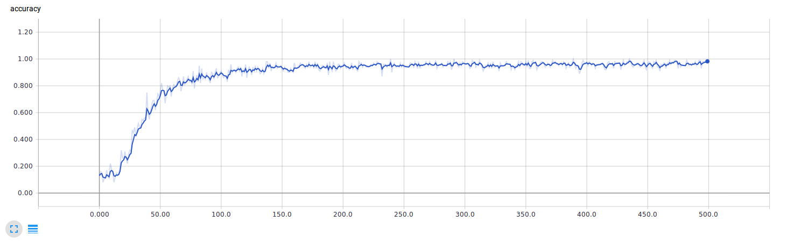

# Japanese Character Recognition

Android application used to recognize hand-written Japanese katakana characters. Uses tensorflow to train a model with convolutional neural networks using a set of images for training.

The goal of this repository is not to get a production-ready application, but rather to provide an example project integrating TensorFlow and Android.

## Training the model

In order for the Android application to recognize characters, a model should be trained first using the tensorflow python library.

Before doing so, the training data needs to be obtained from the following website: [http://etlcdb.db.aist.go.jp/](http://etlcdb.db.aist.go.jp/). The file `ETL1.zip` should be placed under the `data/raw` folder.

The easiest way to run tensorflow with python is using the tensorflow/tensorflow docker image. With [docker installed](https://docs.docker.com/install/), this image can be built and run using the following command from the cloned repository folder:

```
docker run -it -p 6006:6006 -v `pwd`:/Japanese-Character-Recognition -w /Japanese-Character-Recognition tensorflow/tensorflow:1.1.0 bash
```

Once inside the docker container, it's optional (but recommended) to launch tensorboard to monitor the training progress, the web interface can be used at [http://localhost:6006](http://localhost:6006). Launch it on the background with the following command:

```
tensorboard --logdir="data/training_summaries/" &
```

And finally, prepare images data and train the model running the following scripts:

```
python data/prepare.py
python train_model.py
```

Once the training is completed (which may take a while, it took me 35 minutes with the parameters present in this repository), a file will be generated with the name `model.pb` on the root folder. This file contains the parameters of the trained model, which will be used in the Android application in order to recognize characters. To reduce the complexity, I only used 7 characters: アイウエオカキク (this can be configured in the `prepare.py` script). Tuning diferent parameters in the `train_model.py` file and using a different dataset could improve the results; this can be tested looking at the tensorboard graphics: The accuracy should improve in every training step approaching an accuracy of 100%. The following screenshot shows the graphics for my training, it can be observed how the last steps are between 90% and 100% accuracy. It should be noted that even though this tells us an accuracy greater than 90%, it is suffering from overfitting with the current setup.



Once the model is generated, files `model.pb` and `data/katakana/categories.csv` should be copied into the folder `android/app/src/main/assets` for the Android application to use.

## Building the Android app

The application is a standard Android app, so it can be built using [Android Studio](https://developer.android.com/studio/run/index.html) or any other standard Android build system.